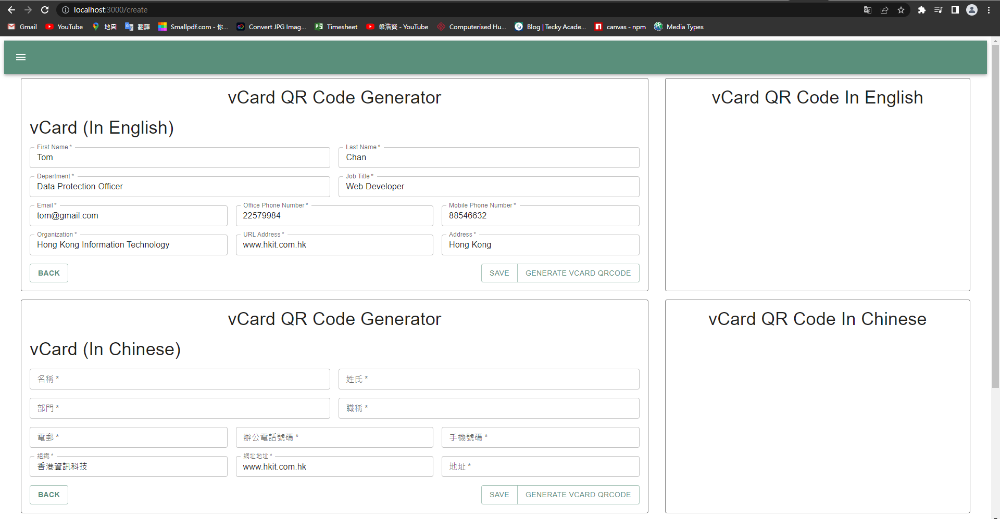

### CRUD Project
> This is my first CRUD project, I used **React, Mui, Node.js, Express, Mysql** to create this webpage. I will show some images how can I design this page.

### Instruction
Nowadays, many people use the smart phone, so I think no one like to keep the entity name card. Then I found out smart phone have a **vCard** format, **vCard** is the file format standard for electronic business cards. This project I am going to generator the qrcode for the user name card. Then they can scan the qrcode, it can automatic connect to their phone's **Contacts**.

This page is generator page, user can input their information. :point_down:
 

Finish input the information, usre can click the save button. :point_down:
 

The data can save it to database.