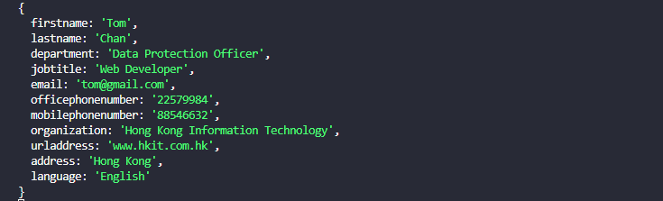
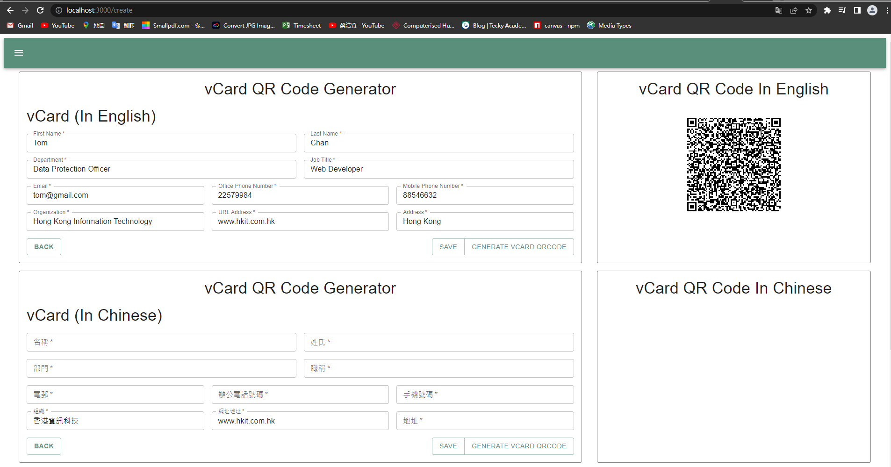

### CRUD Project
> This is my first CRUD project, I used **React, Mui, Node.js, Express, Mysql** to create this webpage. I will show some images how can I design this page.

### Instruction
Nowadays, many people use the smart phone, so I think no one like to keep the entity name card. Then I found out smart phone have a **vCard** format, **vCard** is the file format standard for electronic business cards. This project I am going to generator the qrcode for the user name card. Then they can scan the qrcode, it can automatic connect to their phone's **Contacts**.

This page is generator page, user can input their information. :point_down:
 

Finish input the information, usre can click the save button. :point_down:
 

The data can save it to database. :point_down:  
 

Beside the "Save" button, there have a button call "Genrate vCard qrcode", user can check the qrcode first in this page. Also you can use your :iphone: to scan this rqcode, it can save the same information to your mobile phone connect. It is quite fun :sunglasses:  
:bell: **If you scanned it nothing happened, you can click the image to enlarge, and try again.** :bell: :point_down:
 

After that, user can go back to home page to check the record. :point_down:
 
 

In this record, it can keep the qrcode.  
:bell: **If you scanned it nothing happened, you can click the image to enlarge, and try again.** :bell: :point_down:
 

If have something wrong, it can edit the data. :point_down:
 

The data was edited. :point_down:
 
 

You can scan the qrcode, to check the data.  
:bell: **If you scanned it nothing happened, you can click the image to enlarge, and try again.** :bell: :point_down:
 

In Mysql database, the data was edited. :point_down:
 

Also it can delete the data. :point_down:
